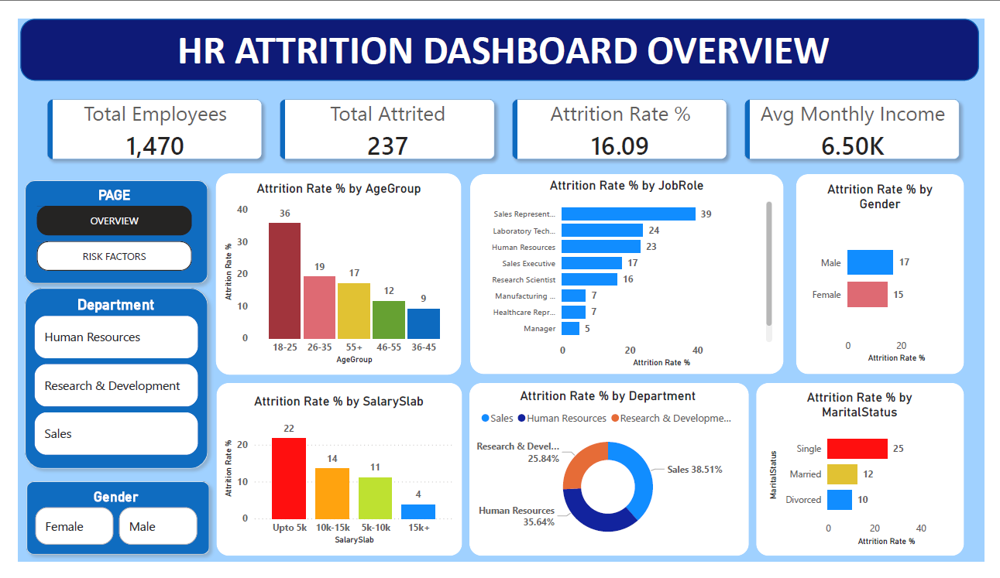
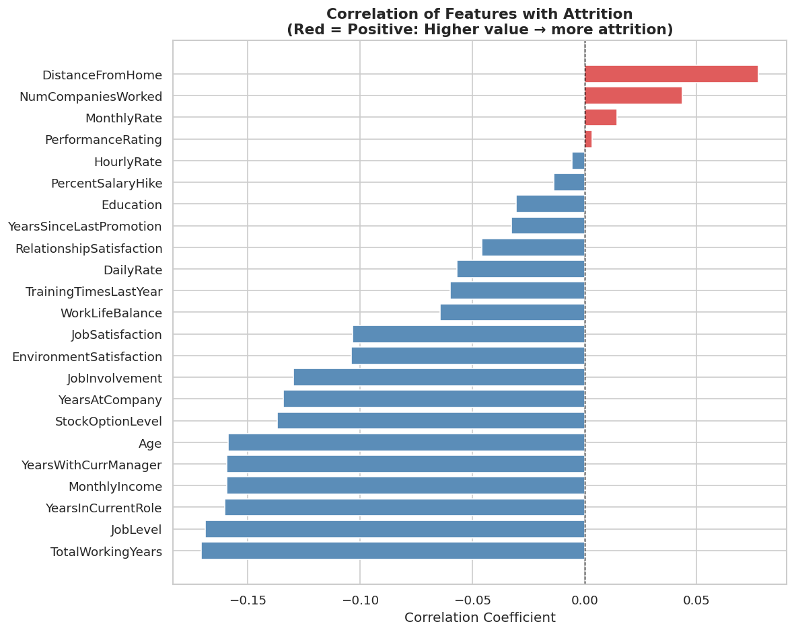
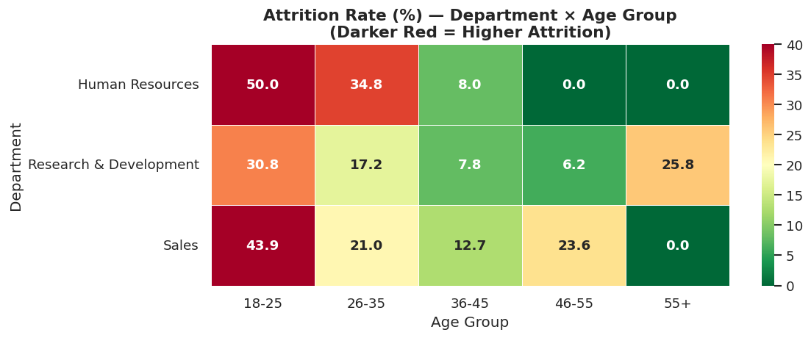
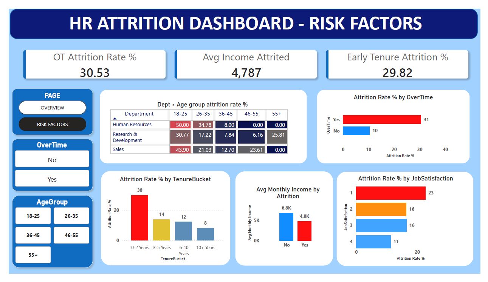

# HR Analytics — Employee Attrition Analysis



## Project Overview

This project analyzes employee attrition data from a company of 1,473 employees to identify the key drivers behind why employees leave. The goal is to provide actionable insights that HR teams can use to improve retention and reduce turnover costs.

The analysis covers data cleaning, SQL-based exploration across 18 queries, statistical analysis in Python, and an interactive two-page Power BI dashboard.

---

## Tools Used

| Tool | Purpose |
|---|---|
| Python (pandas) | Data cleaning and statistical analysis |
| MySQL | Exploratory data analysis via SQL queries |
| Power BI Desktop | Interactive dashboard and visualization |

---

## Dataset

- **Source:** [HR Analytics Dataset — Kaggle](https://www.kaggle.com/datasets/anshika2301/hr-analytics-dataset?select=HR_Analytics.csv)
- **Size:** 1,480 rows × 38 columns (1,473 after cleaning)
- **Target variable:** `Attrition` (Yes / No)
- **Domain:** Human Resources

---

## Project Structure

```
hr-attrition-analysis/
│
├── data/
│   ├── HR_Analytics.csv                        # Raw dataset
│   └── hr_analytics_cleaned.csv                # Cleaned dataset
│
├── notebooks/
│   └── phase1_data_cleaning.ipynb              # Data cleaning steps
│
├── sql/
│   └── hr_analytics_queries.sql                # All 18 SQL queries
│
├── python_analysis/
│   ├── chart1_correlation.png                  # Correlation analysis chart
│   └── chart2_heatmap_dept_age.png             # Dept × Age Group heatmap
│
├── dashboard/
│   ├── hr_attrition_dashboard.pbix             # Power BI source file
│   ├── 1_hr_attrition_dashboard_overview.png   # Page 1 screenshot
│   └── 2_hr_attrition_dashboard_risk_factors.png  # Page 2 screenshot
│
└── README.md
```

---

## Data Cleaning (Python)

Performed in `notebooks/phase1_data_cleaning.ipynb`

| Step | Action | Reason |
|---|---|---|
| Removed duplicates | Dropped 7 duplicate rows | Identical rows skew count-based metrics |
| Dropped constant columns | Removed `EmployeeCount`, `Over18`, `StandardHours` | All had a single value — zero analytical value |
| Fixed missing values | Filled 57 nulls in `YearsWithCurrManager` | Used JobRole-wise median for accuracy |
| Created `AttritionFlag` | Encoded Attrition as 1 (Yes) / 0 (No) | Required for numeric correlation analysis |

**Final cleaned dataset: 1,473 rows × 36 columns**

---

## SQL Analysis

19 queries written and executed in MySQL across 4 categories.
Full queries available in `sql/hr_analytics_queries.sql`

**Category A — Attrition Overview**
- Overall attrition rate, by Department, by Job Role, by Gender, by Marital Status

**Category B — Compensation and Workload**
- Income comparison, Salary Slab analysis, OverTime impact, Salary Hike comparison

**Category C — Satisfaction and Engagement**
- Job Satisfaction, Work-Life Balance, Job Involvement, Burnout profile (OT + Low Satisfaction)

**Category D — Tenure and Growth**
- Tenure bucket analysis, Promotion history, Cumulative attrition by Age Group
- Window functions: `RANK()` by department, `SUM() OVER()` cumulative attrition

---

## Python Analysis

Two statistical charts generated in Python (seaborn / matplotlib) that are not replicable in Power BI.

### Chart 1 — Correlation of All Features with Attrition



Key findings:
- `TotalWorkingYears`, `JobLevel`, and `MonthlyIncome` are the strongest negative correlates — experienced, senior, well-paid employees rarely leave
- `DistanceFromHome` and `NumCompaniesWorked` are the strongest positive correlates — long commutes and job-hopping history are early warning signs of attrition

### Chart 2 — Attrition Rate by Department × Age Group



Key findings:
- The 18–25 age group shows crisis-level attrition across all departments — 50% in HR, 43.9% in Sales, 30.8% in R&D
- Retention of young employees is the company's most urgent HR challenge

---

## Key Findings

| # | Finding | Metric |
|---|---|---|
| 1 | Overall attrition rate | **16.1%** — 1 in 6 employees left |
| 2 | Highest risk job role | **Sales Representatives at 39.3%** |
| 3 | Overtime drives attrition | **30.5% vs 10.4%** — OT employees are 3× more likely to leave |
| 4 | Income gap | **Leavers earn ₹4,787 vs ₹6,829** avg — 30% lower |
| 5 | Marital status | **Single employees at 25.5%** vs Married 12.4% — 2× higher |
| 6 | Early tenure risk | **0–2 year employees at 29.8%** — highest attrition window |
| 7 | Burnout profile | **OT + Low Job Satisfaction = 37.7% attrition** — single biggest flight risk |
| 8 | Engagement matters | **Job Involvement Level 1 = 33.7%** vs Level 4 = 8.97% |

### Counterintuitive Finding
Employees with no promotion in 5+ years (14.2%) left *less* than those promoted within 5 years (16.5%). Long-tenured employees appear to have settled into stability, while recently promoted employees may still feel underpaid relative to new expectations — suggesting promotion alone is not sufficient for retention without accompanying compensation adjustments.

---

## Power BI Dashboard

An interactive two-page dashboard built in Power BI Desktop.

### Page 1 — Attrition Overview
Headline numbers and a breakdown of who is leaving across role, department, salary, age, and demographics.


### Page 2 — Risk Factor Deep Dive
Identifies why employees are leaving — overtime, income gap, tenure, satisfaction, and the department × age group heatmap.



**DAX Measures written:**
```
Attrition Rate % = DIVIDE(COUNTROWS(FILTER(...Attrition="Yes")), COUNTROWS(...), 0) * 100
Total Attrited = COUNTROWS(FILTER(...Attrition="Yes"))
Avg Monthly Income = AVERAGE(MonthlyIncome)
OT Attrition Rate % = attrition rate filtered to OverTime = Yes
Avg Income Attrited = CALCULATE(AVERAGE(MonthlyIncome), Attrition = "Yes")
Early Tenure Attrition % = attrition rate filtered to YearsAtCompany <= 2
```

**Calculated Column:**
```
TenureBucket = SWITCH(TRUE(), YearsAtCompany<=2, "0-2 Years", <=5, "3-5 Years", <=10, "6-10 Years", "10+ Years")
```

---

## Business Recommendations

Based on the analysis, three high-priority actions for HR:

1. **Address overtime immediately** — 30.5% of overtime employees leave vs 10.4% without. Audit teams with high OT and redistribute workload or add headcount.

2. **Focus retention efforts on the first 2 years** — 29.8% of new joiners leave within 2 years. Structured onboarding, mentorship programs, and 6-month check-ins would directly target the highest risk window.

3. **Review Sales Representative compensation** — at 39.3% attrition, nearly 1 in 2 Sales Reps leaves. A compensation benchmarking study against market rates is the most direct intervention.

---

## How to Run

**Data Cleaning Notebook:**
```
1. Install dependencies: pip install pandas numpy
2. Place HR_Analytics.csv in the same folder as the notebook
3. Open phase1_data_cleaning.ipynb in Jupyter
4. Run all cells — outputs hr_analytics_cleaned.csv
```

**SQL Queries:**
```
1. Import hr_analytics_cleaned.csv into MySQL
2. Open hr_analytics_queries.sql in MySQL Workbench
3. Run queries individually (select query → Ctrl+Shift+Enter)
```

**Power BI Dashboard:**
```
1. Open hr_attrition_dashboard.pbix in Power BI Desktop
2. If data doesn't load, go to Home → Transform Data → update file path to your local hr_analytics_cleaned.csv
3. Click Refresh
```

---

## Author

**RAJ RATHOD**  
Aspiring Data Analyst | SQL · Python · Power BI  
https://www.linkedin.com/in/raj-rathod-0718a3249/ · https://github.com/rajrathod2048
